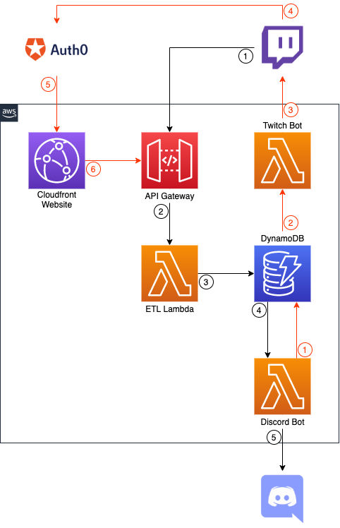

# Twitch Channel Points Hackathon

The [Twitch Channel Points Hackathon](https://twitchchannelpoints.devpost.com/) is running between Feb 1st 2020 and March 29th 2020. 

## Project

The aim is to allow a broadcaster to configure channel points that interact with a discord bot. For the example, this will be to add the viewer who redeems the reward to a specific reward within the broadcaster's discord server.

## Design

### Happy Path (Black Path)

* Viewer redeem's channel point reward, and twitch sends an Event Sub notification to the API Gateway
* The API Gateway sends the request to the ETL lambda
* The ETL lambda configures the data to insert into the DynamoDB table
* The DynamoDB table streams the data to the Discord Bot
* The Discord Bot finds the user based on the input from the reward and adds the user to the reward's role

## Un-Happy Path (Red Path)

Description: When there is an issue with identifying the user within Discord. I.e. the user was not found.

* Discord Bot updates the DynamoDB table with the error state
* The DynamoDB table streams the data to the Twitch Bot 
* The Twitch Bot speaks on the Twitch channel to the user who redeemed the reward, sending them a link to the Error Page
* The viewer verifies their identity with Auth0's connection to Twitch and provides the correct data
* The Error Page sends the corrected data to the API gateway which returns to the happy path.
